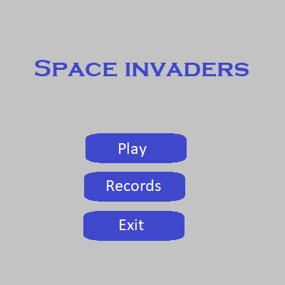
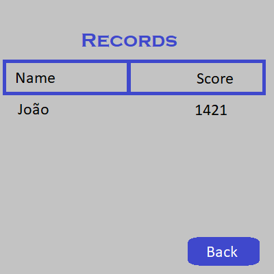
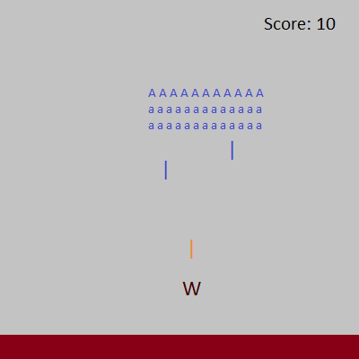

# ldts-project-assignment-g1006
ldts-project-assignment-g1006 created by GitHub Classroom

## LDTS_<10><1006> - Space Invaders

In this text based game you'll fight the Earth invaders with your own spaceship! The objective is to take down every single alien ship without being hit once. If your ship is the last one standing you won the game. Good luck, our future is in your hands.

### Features List

- **Movement** - Single direction movement. Every spaceship moves horizontally.

- **Aliens** - Represented by character 'A'. They switch direction when they are about to leave the arena.
- **Ammo** - The player can shoot multiple bullets. If an alien is hit, it will die and dissapear from the screen.

- **Aliens** - They exist in many shapes and forms. Some will be able to shoot back at the player (only the ones that dont have any others bellow them). They can have armor aswell.

- **Menu** - We will design a Menu for the game, which will be able to redirect the player to the leaderboard or the game.

- **Leaderboard** - Contains the best players' names, and the time that needed to defeat the Aliens.

- **Shields** - They will be deployed between the Player and the Aliens. They can suport a limited ammount of Ammo, so they will eventually break.

- **Ammo** - The ammo that the player can shoot will be limited. In this way, it can only shoot one or a few bulltets at a time.

### Mockups

- Menu

  

- Leaderboard

  

- Gameplay

  

This project was developed by Alexandre Correia (up202007042@fe.up.pt), Henrique Silva (202007242@fe.up.pt) and Tiago Branquinho (up202005567@fe.up.pt) for LDTS 2021⁄22.
