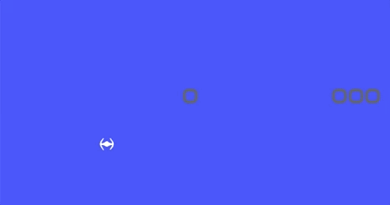

# ldts-project-assignment-g1006
ldts-project-assignment-g1006 created by GitHub Classroom

## LDTS_<10><1006> - Space Invaders

In this text based game you'll fight the Earth invaders with your own spaceship! The objective is to take down every single alien ship without running out of lives. If your ship is the last one standing you won the game. Good luck, our future is in your hands.

This project was developed by Alexandre Correia (up202007042@fe.up.pt), Henrique Silva (202007242@fe.up.pt) and Tiago Branquinho (up202005567@fe.up.pt) for LDTS 2021⁄22.

## How to Play

In order to defeat the army of Aliens, you only need your arrow keys! 
- ARROW_UP to shoot
- ARROW_LEFT to go left
- ARROW_RIGHT to go right

You can also press 'q' to exit the game at any point.

## Screenshots and animations

The following content describes how our game looks like, as well as its features:

### Game preview

- Player Shooting

  

 
 

- Alien Shooting

  

 
 

- Walls

  

 
 

- Not as easy as you might think!

  

 
 

### Menus

- Main menu

  

 
 

- Leaderboard

  

 
 

- Won menu

  

 
 

- Lost menu

  

 
 

