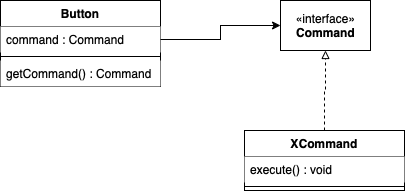
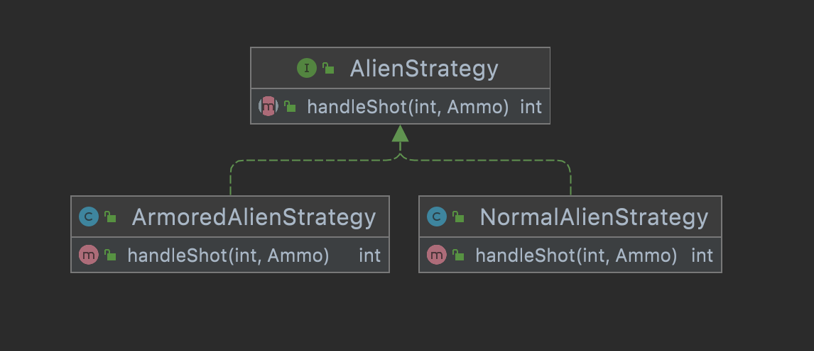

# ldts-project-assignment-g1006
ldts-project-assignment-g1006 created by GitHub Classroom

## LDTS_<10><1006> - Space Invaders

In this text based game you'll fight the Earth invaders with your own spaceship! The objective will be to take down every single alien ship without running out of lives. If your ship is the last one standing you won the game. Good luck, our future is in your hands.

This project was developed by Alexandre Correia (up202007042@fe.up.pt), Henrique Silva (up202007242@fe.up.pt) and Tiago Branquinho (up202005567@fe.up.pt) for LDTS 2021/2022.

### Implemented Features

- **Connected Menus** - The user has the capability of browsing through all the different menus, which are: main menu, won menu, lost menu, leaderboard menu and playing menu, where the game takes place.

- **Buttons** - The user can switch the selected button with the respective ARROW KEYS, according to their relative position. They are activated by pressing ENTER.

- **Leaderboard** - If the player ends up victorious, he can choose to add his name to the current Leaderboard, which is a file that contains information about the winners and their times.

- **Movement** - Single direction movement. Every spaceship, including the player, only moves horizontally. Alien movement is automatic.

- **Aliens** - They switch direction when they are about to leave the arena or in the inevitability of colliding with each other. Some are Armored and others are Normal ones, which are drawn differently.

- **Ammo** - The player can shoot up to 2 bullets shown in the arena. If an alien is hit, there are many possibilities:
  - If the alien is normal, it will die and disappear from the screen, since it has 0 armor;
  - If the alien is armored and the ammo can't kill it, if it didn't break the alien's armor, the ammo will be reflected and the armor will be reduced;
  - If a bullet kills a certain alien, it will continue through it, with its damage reduced, if it is greater than 0.

- **Walls** - The arena has a few walls with a fixed number of resistance, in order for the player to defend itself.

- **Player** - Has 3 lives.

- **Animations** - When an alien loses its armor it becomes a normal one, changing its form and colour.

- **Graphics** - There are several custom shapes implemented in the game.

- **Collisions detection** - Collisions between ammo and spaceships or walls are taken into consideration. The game will be over if either the player or all aliens die.

- **Randomness** - The player's ammo has a 40% chance of dealing 2 damage, which is represented by a "darker" colour. Plus, the armor of the alliens at the start of a game is random, varying from 0 to 3.

### Planned Features

We've managed to add every planned feature and a few more.

## DESIGN

  

### Singleton Pattern

**Problem in Context**

While thinking about the Game itself, we realised that there could be lots of Game class objects created during an execution of the code. That is obviously incorrect, since there can only be ONE object of the Game class.
Link to Game class constructor: https://github.com/FEUP-LDTS-2021/ldts-project-assignment-g1006/blob/main/src/main/java/com/spaceinvaders/Game.java#L22 .

**The Pattern**

We decided to use the Singleton Pattern, which can be classified as a Creational Pattern. This limits the ammount of instances of a class, so it can have only one, which can be called from anywhere in the code.

**Implementation**

The following image shows in detail how the pattern was implemented:

  

The code regarding this pattern can be found in the following links:
- Game - Singleton: https://github.com/FEUP-LDTS-2021/ldts-project-assignment-g1006/blob/main/src/main/java/com/spaceinvaders/Game.java#L20
- Game - getInstace: https://github.com/FEUP-LDTS-2021/ldts-project-assignment-g1006/blob/main/src/main/java/com/spaceinvaders/Game.java#L28
- Application: https://github.com/FEUP-LDTS-2021/ldts-project-assignment-g1006/blob/main/src/main/java/com/spaceinvaders/Application.java#L9

**Consequences**

The usage of this pattern had a positive impact in our code, since it completely solved our problem. In fact, it was impossible to achieve what we wanted using a regular constructor for the game class, since constructors always return a new object, by design.

### Command Pattern

**Problem in Context**

We realized that the class Button would have to be extended by many others, since there are naturally buttons with unique functionalities. The problem is that the creation of those several subclasses would eventually become exponencial.

**The Pattern**

We decided to use the Command Pattern, which can be considered a Action Pattern. This can structure a system around high-level operations built on primitive operations. In fact, this design turns a funtion call into an object that contains all the information about the request itself, letting you use various commands with the same request sender.

**Implementation**

The following image shows in detail how the pattern was implemented:

  

These classes can be found in the following files:
- [Button](../src/main/java/com/spaceinvaders/model/menu/Button.java)
- [Command](../src/main/java/com/spaceinvaders/controller/command/ButtonCommand.java)

**Consequences**

The usage of this pattern granted the ability to separate the entity that invokes the operation from the element that knows how to handle and performs it.

### Facade Pattern

**Problem in Context**

The lanterna libraby includes many features, but only a small portion of them is really needed for this projetct. Plus, we realised that, before implementing this pattern, the logic of our classes would be highly dependent on the details of third-party classes, making it hard to understand.

**The Pattern**

We decided to use the Facade Pattern, which can be considered a Structural Pattern, since it provides a simplified interface to a complex libraby.

**Implementation**

The following image shows in detail how the pattern was implemented:

  

These classes can be found in the following files:
- [Game](../src/main/java/com/spaceinvaders/Game.java)
- [GUI](../src/main/java/com/spaceinvaders/gui/GUI.java)
- [LanternaGUI](../src/main/java/com/spaceinvaders/gui/LanternaGUI.java)

**Consequences**

This pattern solved a violation on the Dependency Inversion Principle, since if we used the hole libraby, a high level module would be directly depending on a low level module. Basically we created an interface that only contains features that we really care about.

### Strategy Pattern

**Problem in Context**

Initially, we thought about creating several subclasses in order to diversify the different types of Aliens. The issue is that, in that way, our code wouldn't be versatile. In fact, adding more Alien types would require a lot of changes to the code, and bugs were more likely to appear.

**The Pattern**

We decided to use the Strategy Pattern, which can be considered a Behavioral Pattern. This can define a family of algorithms, putting each on a separate class, making the objects interchangable.

**Implementation**

The following image shows in detail how the pattern was implemented:

  

These classes can be found in the following files:
- [Alien](../src/main/java/com/spaceinvaders/model/Alien.java)
- [AlienStrategy](../src/main/java/com/spaceinvaders/model/AlienStrategy.java)
- [NormalAlienStrategy](../src/main/java/com/spaceinvaders/model/NormalAlienStrategy.java)
- [ArmoredAlienStrategy](../src/main/java/com/spaceinvaders/model/ArmoredAlienStrategy.java)

**Consequences**

In this case, the Alien class, considered the Context Class. It isn’t responsible for selecting an appropriate algorithm for the job. Instead, the client passes the desired strategy to the context, which is independent of the concrete strategies. 
Adding new types of Aliens is also easier.

### Architectural and State Pattern

**Problem in Context**

We quickly figured that many files would be needed for our project to work out, and the structure of the hole code started to be a concern. 

**The Pattern**

We decided to use the Model-View-Controller Pattern, which can be considered an Architectural one that is frequently used in a GUI. Besides that, we also implemented the State Pattern, considered a Behavioral Pattern, that lets an object alter its behavior when its internal state changes. It appears as if the object changed its class.

**Implementation**

The following image shows in detail how the pattern was implemented:

  

The game states allows the game to alter its behavior in a very simple and efficient way.

**Consequences**

The MVC pattern heavily contributed to the organization of our code, which eases the implementation of new features. On the other hand, the State Pattern also allows the representation of the several menus to be very explicit and clear.

## KNOWN CODE SMELLS AND REFACTORING SUGGESTIONS

#### **Data classes**
https://refactoring.guru/smells/data-class

This code smell is present in our code, since all Model Classes are Data Classes, in the way that they are simply containers for data used by other classes. On the other hand, this classes also can't independently operate on data, since that's secured by the Controller classes.
Furthermore, this is not a bad code smell, since it exists due to the implementation of the MVC Pattern, which had a very positive impact in our code.

#### **Feature envy and message chains**
https://refactoring.guru/smells/feature-envy

As the result of the MVC pattern some of the controllers use is narrowed to its model method calls. Our controller envies its model.
Also, acessing a model's parameter can only be done by its controller, causing some message chains.

https://refactoring.guru/smells/message-chains

#### **Large Class**
https://refactoring.guru/smells/large-class

Some classes, for instance LanternaGUI, contain a lot of methods, and others, like Game, a lot of fields, eventhough we think that is acceptable and completely normal regarding the structure of our game. In fact, the Game class stores a big amount of data, since it is the main one. On the other hand, LanternaGUI class contains various methods needed for the interface, and it wouldn't make sense to split the classe into several ones.

## Testing

### Screenshot of coverage report

  

### Link to mutation testing report

[Mutation tests](pitest_report/index.html)

Note that spock tests are not taken into consideration in this report, that justifies the low coverage on Better Code Hub.

## SELF-EVALUATION

In our opinion, each individual of the group worked and contributed a lot to this project. While everyone focused on developing and testing new features on an early stage of the project, on a later stage each individual focused more on specific parts of it. For instance:
- Alexandre Correia implemented MVC, State and Command patterns, as well as Menus and Buttons;
- Henrique Silva focused probability functions, bug fixing, and Alien movement;
- Tiago Branquinho implemented the Strategy and Singleton Patterns, made the report, the font and implemented reads and writes to files.

Considering that, we evaluate ourselves like this:
- Alexandre Correia: 36%
- Henrique Silva: 32%
- Tiago Branquinho: 32%
